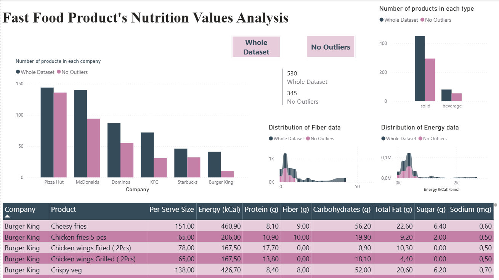
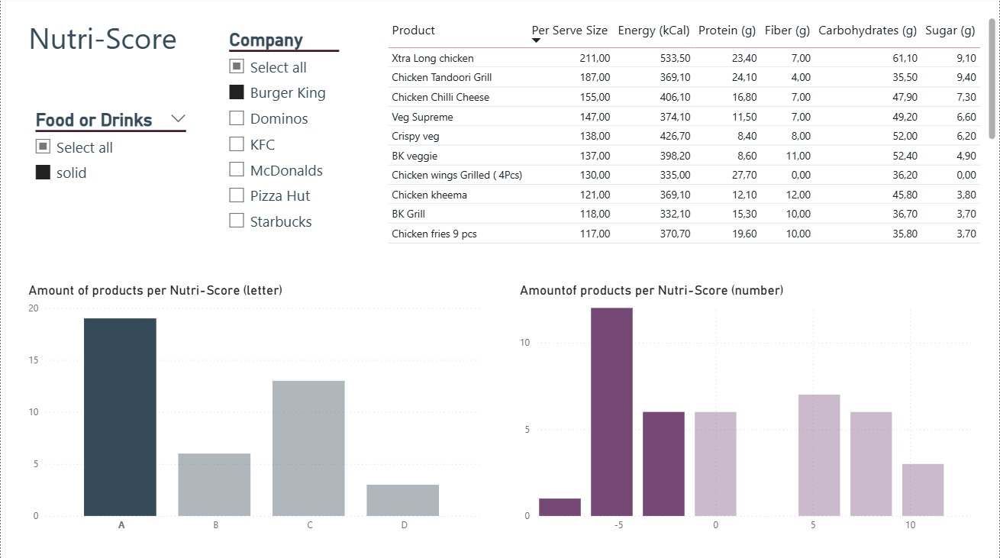

# Fast-Food-Items-Nutritional-Values-Analysis
A short analysis of the nutritional values from 6 different fast food chains. Taking a look at the healthier options using the Nutri-Score.

### Purpose of the analysis
This project analyzed the nutritional profiles of menu items from 6 major fast-food restaurants to evaluate the availability of healthier options. The dataset included values such as calories, fat, carbohydrates, protein, sugar, and sodium across various meal categories. Using Python (Pandas, NumPy, and Matplotlib), the data was cleaned, standardized, and explored through descriptive statistics and visual analysis. Correlation analysis was conducted to examine relationships between nutritional components — for instance, the strong positive correlation between calories and carbohydrates.

In the Power BI file, the first page contains a summary of the data presented in the Jupyter notebook, and the second page showcases different filters to get food items from each restaurant based on the Nutri Score. This way, it is easy to observe which are the healthiest choices.

|  |  |
|:-------------------------------------------:|:------------------------------------:|
| **Fast Food Items Dashboard** | **Nutri-Score Filter** |

Another interesting approach was to determine whether it was possible to predict which fast food restaurant an item came from based on its nutritional values. Using a Random Forest model, I achieved an accuracy of 96%.

A more in-depth analysis can be found in the PDF file.

### Dataset Sources:
Fast Food Joint Nutrition Values Dataset - https://www.kaggle.com/datasets/rakkesharv/fast-food-joint-nutrition-values-dataset 

Nutrition, Physical Activity, and Obesity - Behavioral Risk Factor Surveillance System - https://data.cdc.gov/Nutrition-Physical-Activity-and-Obesity/Nutrition-Physical-Activity-and-Obesity-Behavioral/hn4x-zwk7/about_data 

McDonald's locations (United States) - https://www.kaggle.com/datasets/mdmdata/mcdonalds-locations-united-states 
